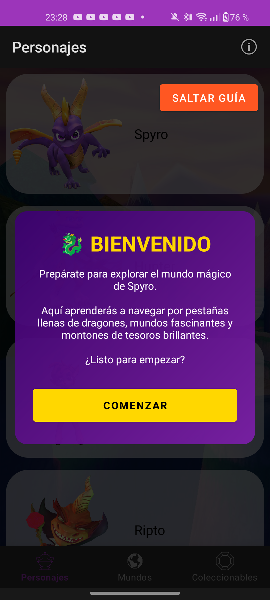
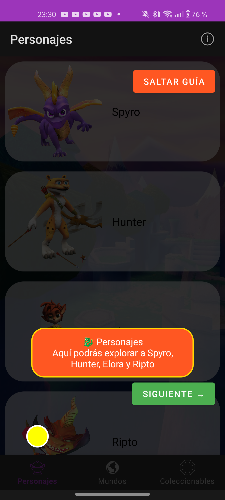
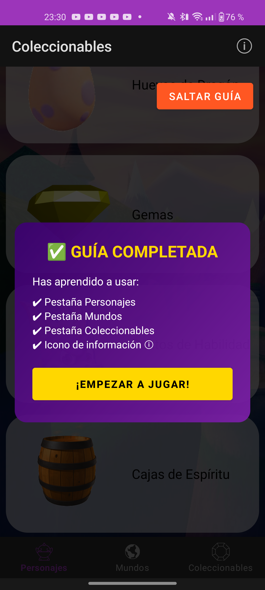
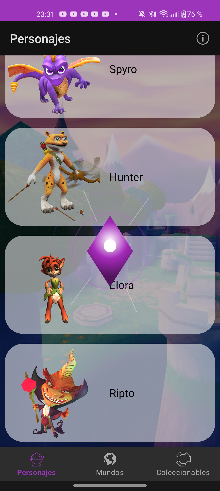
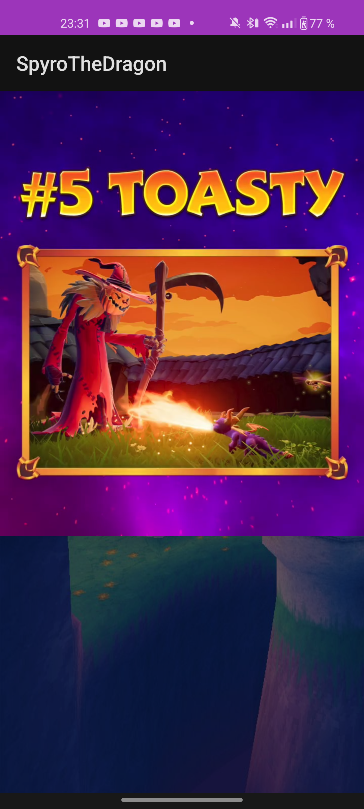

# Aplicación Android de Spyro The Dragon (Guía Multimedia)

## Introducción
Este proyecto es una aplicación educativa desarrollada para el módulo de **Programación Multimedia y Dispositivos Móviles (DAM)**. La aplicación sirve como una enciclopedia interactiva sobre el universo de *Spyro The Dragon*, centrada en la integración de contenidos multimedia avanzados, animaciones personalizadas y la gestión de eventos táctiles específicos.

## Características principales
La aplicación se divide en tres secciones principales accesibles mediante navegación inferior:
* **Pestaña Personajes:** Listado de héroes y villanos. Incluye interactividad avanzada en elementos específicos.
* **Pestaña Mundos:** Guía de los reinos mágicos con un sistema de detección de patrones de clic.
* **Pestaña Coleccionables:** Información sobre los objetos icónicos del juego.
* **Guía de Inicio Interactiva:** Un sistema de 5 pasos que utiliza *overlays* para bloquear la interfaz y explicar las funcionalidades mediante animaciones de latido y sonidos temáticos. Solo se muestra en la primera ejecución.
* **Easter Eggs:**
    * **Vídeo Secreto:** Activado tras realizar 3 clics consecutivos en la misma tarjeta de la pestaña Mundos.
    * **Efecto de Energía Mágica:** Una animación dinámica creada con la clase `Canvas` que se dispara al realizar una pulsación prolongada sobre el villano Ripto.

## Tecnologías utilizadas
Para el desarrollo de las funcionalidades multimedia se han empleado las siguientes tecnologías nativas de Android:
* **Control de Animaciones:** `ObjectAnimator` y `AnimatorSet` para la coreografía de la guía, y `AnimationUtils` para los efectos de *flash* en las tarjetas.
* **Gráficos 2D Personalizados:** Clase `Canvas` y `Paint` para la renderización dinámica de la energía del cetro (Apartado E).
* **Reproducción Multimedia:** `MediaPlayer` para efectos de sonido (.wav) y `VideoView` para la reproducción del Easter Egg de vídeo (.mp4).
* **Persistencia de Datos:** `SharedPreferences` para gestionar el estado de visualización de la guía (Apartado B).
* **Navegación:** `Navigation Component` con paso de fragmentos y personalización de transiciones.

## Instrucciones de uso
1.  **Clonación:** Clonar el repositorio desde GitHub.
2.  **Configuración:** Abrir el proyecto en Android Studio (Ladybug 2024.2.1 o superior).
3.  **Ejecución:** Compilar y ejecutar en un emulador o dispositivo físico con API 31+.
4.  **Guía:** Seguir los pasos de la guía interactiva o pulsar "Saltar guía".
5.  **Descubrimiento:** Probar 3 clics en un mundo o una pulsación larga en Ripto para activar los secretos.

## Conclusiones del desarrollador
El desarrollo de esta aplicación ha permitido profundizar en la importancia de la **retroalimentación (feedback)** visual y acústica en la experiencia de usuario. El mayor desafío técnico residió en la sincronización de las animaciones de la guía y la correcta liberación de recursos del `MediaPlayer` para evitar fugas de memoria. La implementación de una vista personalizada mediante `Canvas` proporcionó una comprensión sólida sobre el ciclo de redibujado de las vistas en Android.

## Galería Visual

  
  
  
  
  

---
**Curso académico:** 2025/26
**Ciclo formativo:** DAM
